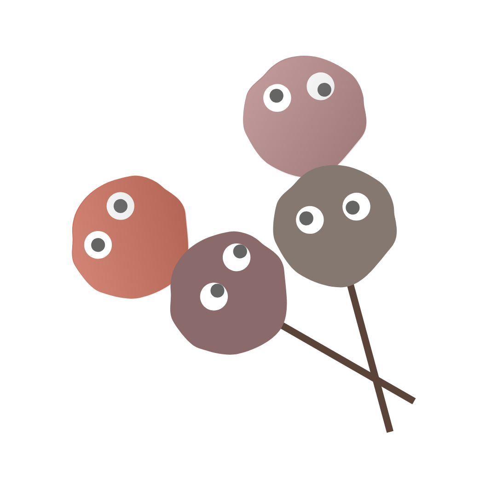

  

<h1 align="center">MeetBalls</h1> 

MeetBalls is an all-in-one companion web application to Zoom that aims to help meeting secretaries manage meetings and improve productivity

---

Frontend: 

Backend: 

## About
MeetBalls aims to automate or simplify traditional tasks for secretaries with features such as an agenda planner, automated attendance taking and timekeeping, mass emails, et cetera to participants in a bid to make meetings less painful to manage.
## Demo

You can try out our app at https://meetballsapp.com/!
Simply login with your Zoom account (currently available for NUS only)

## Tech Stack

- NestJS for Backend
- ReactJS for Frontend
- Docker-compose for local development

## Developer Team

|Team members | Number    | Contributions                                                 |
|---------    |---------- |----------------                                               |
|Ang Chun Yang| A0180311X | Backend (Participants, Suggestions, Agenda Items)             |
|Chong Wen Hao| A0217317J | Frontend, UI/UX, Graphics design                              |
|Lim Jin Hao  | A0205878R | Backend (Authentication, Meeting), Zoom integration, Socket integration |
|Ong Ying Gao | A0201924N |Frontend, Business logic, Backend Integration                  |

- Ang Chun Yang A0180311X
- Chong Wen Hao A0217317J
- Lim Jin Hao A0205878R
- Ong Ying Gao A0201924N

## Disclaimer

This repository is diverged from the main [repo](https://github.com/CS3216-Meetballs?type=source) for record purpose